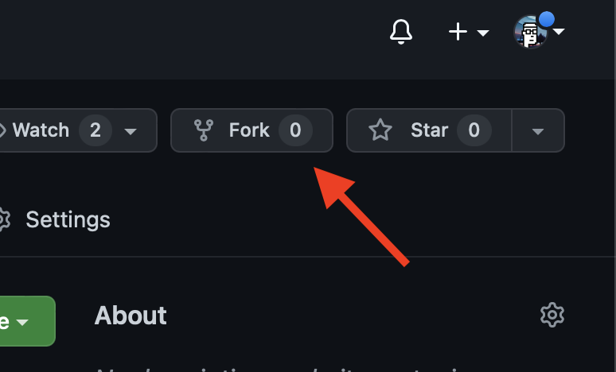
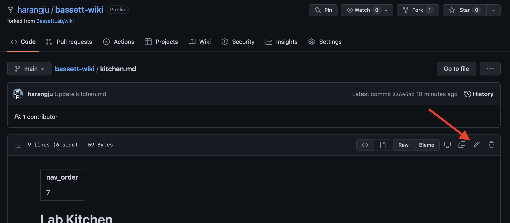
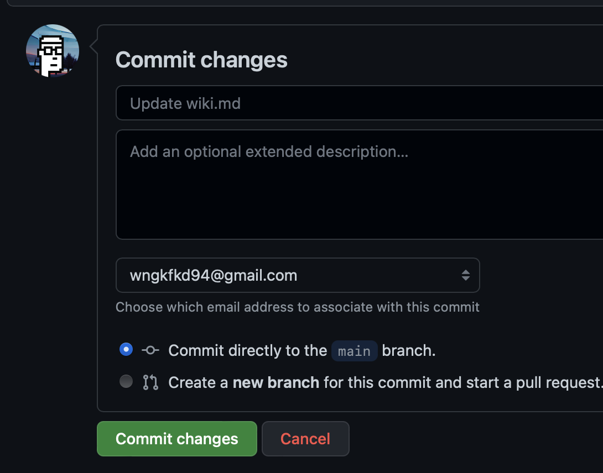
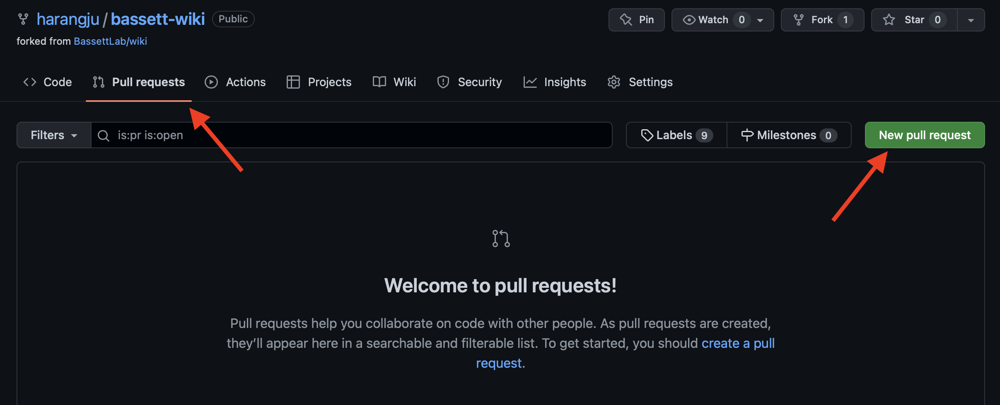
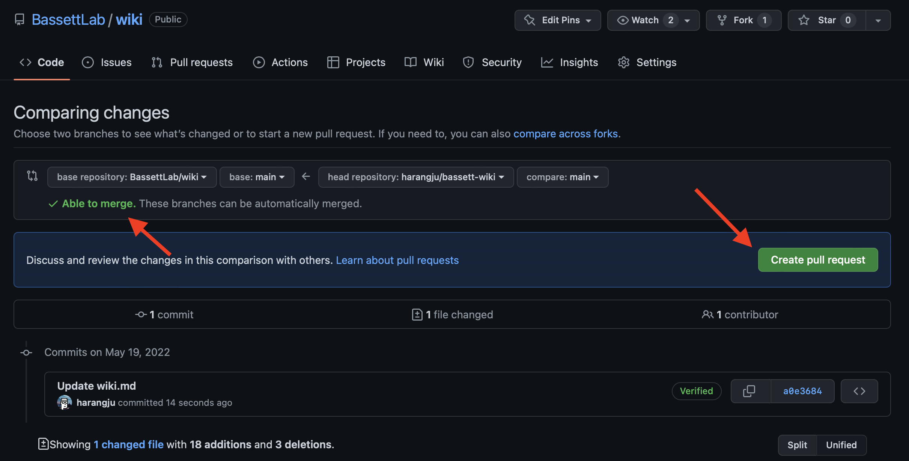
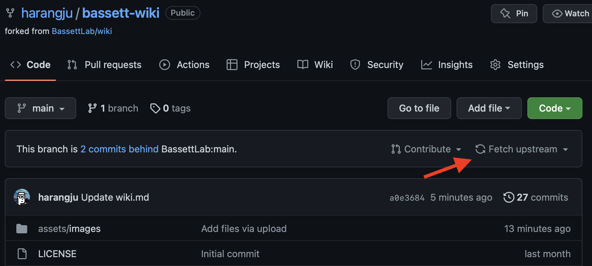
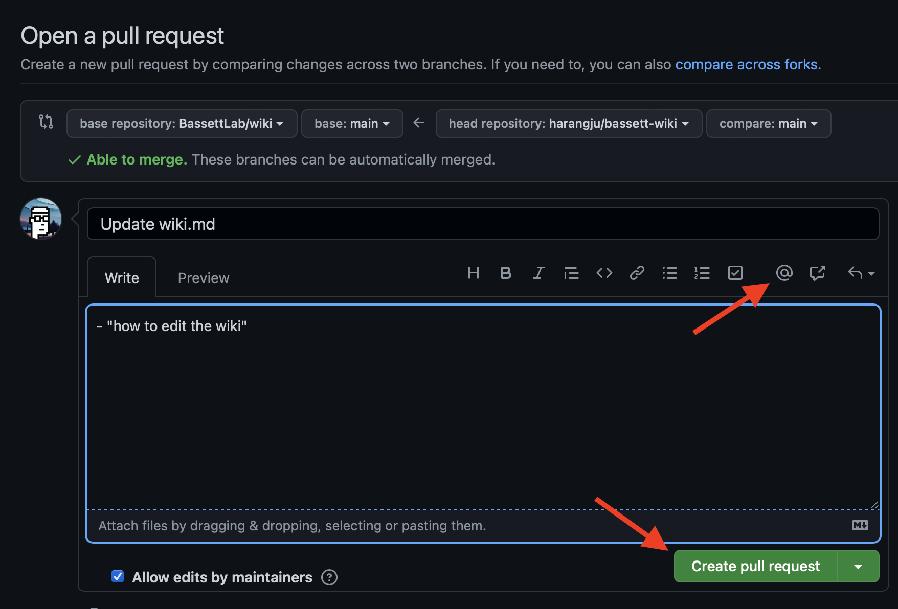
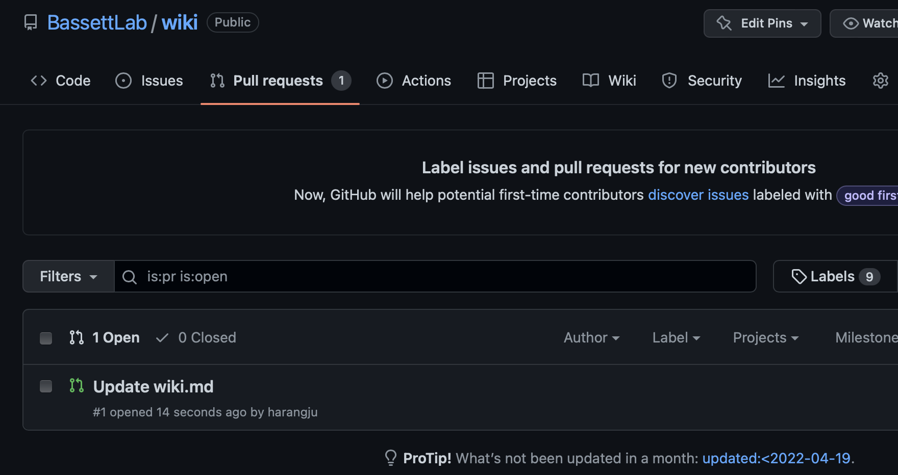

# Editing the wiki

## Contact
Wiki Master: Harang [email](mailto:harang@pennmedicine.upenn.edu)

## How to edit

### Prerequisites
- Use [git](https://git-scm.com/doc) and [GitHub](https://github.com/BassettLab/wiki) to edit the document
- Use [markdown](http://markdownguide.org) for document formatting

### Suggest changes
1. Go to the GitHub [page](https://github.com/BassettLab/wiki) for the lab wiki.
2. Fork the repository. 
3. Edit the document. 
4. Commit your changes at the bottom of the page. 
5. Go to the "Pull Requests" tab, and click "New pull request". 
6. Compare changes, and click "Create pull request". If unable to merge, you may need to "fetch upstream" from the main repository.  
7. Write a short but descriptive message to describe the change. Optionally, tag the wiki master. Create pull request. 
8. You can check back on the status of the pull request on the main BassettLab repository. 
